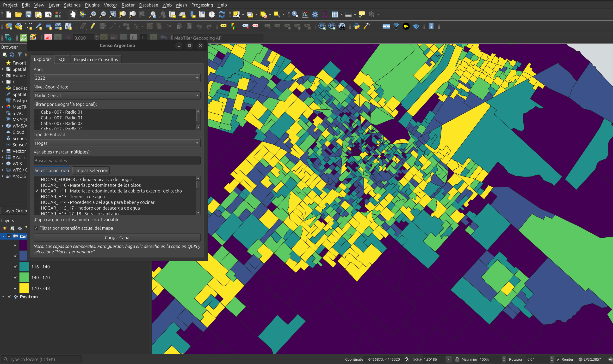

# Plugin de Censo Argentino para QGIS

Plugin de QGIS para cargar datos del [Censo Nacional 2022](https://source.coop/nlebovits/censo-argentino) del INDEC desde Source.Coop (licencia CC-BY-4.0).

## 📚 Documentación

**[Documentación completa](https://nlebovits.github.io/censo-argentino-qgis/)**

- [Instalación](https://nlebovits.github.io/censo-argentino-qgis/instalacion/)
- [Inicio Rápido](https://nlebovits.github.io/censo-argentino-qgis/inicio-rapido/)
- [Modo SQL](https://nlebovits.github.io/censo-argentino-qgis/sql/)
- [Desarrollo](https://nlebovits.github.io/censo-argentino-qgis/desarrollo/)
- [Contribuir](https://nlebovits.github.io/censo-argentino-qgis/contribuir/)

## Instalación

**Instalación desde archivo ZIP:**

1. Descargar el archivo ZIP: [censo-argentino-qgis-0.3.1.zip](https://github.com/nlebovits/censo-argentino-qgis/releases/download/v0.3.1/censo-argentino-qgis-0.3.1.zip)
2. Abrir QGIS
3. Ir a **Complementos → Administrar e instalar complementos**
4. Hacer clic en la pestaña **Instalar desde ZIP**
5. Seleccionar el archivo ZIP descargado
6. Hacer clic en **Instalar complemento**
7. Reiniciar QGIS

El plugin estará disponible en el repositorio oficial de QGIS próximamente.

## Desarrollo y Contribución

Ver la [guía de desarrollo](https://nlebovits.github.io/censo-argentino-qgis/desarrollo/) para:
- Arquitectura del plugin
- Configuración de entorno de desarrollo
- Ejecución de tests
- Proceso de release

¡Las contribuciones son bienvenidas! Ver la [guía de contribución](https://nlebovits.github.io/censo-argentino-qgis/contribuir/).

## Licencia

Apache 2.0 - Ver [LICENSE](LICENSE) para más detalles.

## Autor

Nissim Lebovits - [nlebovits@pm.me](mailto:nlebovits@pm.me)
