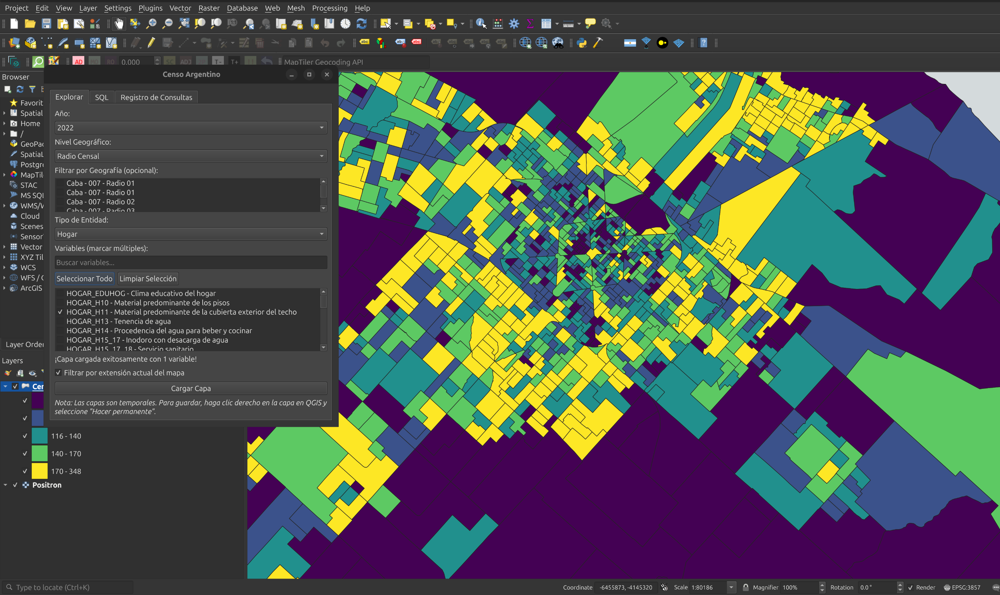

# Plugin de Censo Argentino para QGIS

Plugin de QGIS para cargar datos de los censos nacionales argentinos (1991, 2001, 2010, 2022) del INDEC desde [Source.Coop](https://source.coop/nlebovits/censo-argentino) (licencia CC-BY-4.0).

## 📚 Documentación

**[Documentación completa](https://nlebovits.github.io/censo-argentino-qgis/)**

- [Instalación](https://nlebovits.github.io/censo-argentino-qgis/instalacion/)
- [Inicio Rápido](https://nlebovits.github.io/censo-argentino-qgis/inicio-rapido/)
- [Modo SQL](https://nlebovits.github.io/censo-argentino-qgis/sql/)
- [Desarrollo](https://nlebovits.github.io/censo-argentino-qgis/desarrollo/)
- [Contribuir](https://nlebovits.github.io/censo-argentino-qgis/contribuir/)

## Instalación

**Método recomendado - Repositorio oficial de QGIS:**

1. Abrir QGIS
2. Ir a **Complementos → Administrar e instalar complementos**
3. En la pestaña **Todos**, buscar "Censo Argentino"
4. Hacer clic en **Instalar complemento**
5. El plugin aparecerá en **Complementos → Censo Argentino**

**Instalación manual desde ZIP:**

Si necesitas instalar una versión específica, puedes descargar el archivo ZIP desde [Releases](https://github.com/nlebovits/censo-argentino-qgis/releases) e instalar desde la pestaña **Instalar desde ZIP** en el administrador de complementos.

**Nota sobre dependencias:** El plugin requiere el paquete Python `duckdb`. **Recomendación:** Instala primero el plugin [QDuckDB](https://plugins.qgis.org/plugins/qduckdb/) y actívalo antes de instalar Censo Argentino, esto evita problemas con `pip install duckdb`. Si encuentras errores, consulta la [Guía de Solución de Problemas](https://nlebovits.github.io/censo-argentino-qgis/solucion-problemas/#error-modulo-duckdb-no-encontrado).

**Nota sobre rendimiento:** La primera vez que uses el plugin, tardará 5-15 segundos en cargar metadatos del censo (variables, categorías, códigos geográficos). Estos datos se cachean localmente y en usos posteriores todo carga instantáneamente. Ver más en [Rendimiento y Caché](https://nlebovits.github.io/censo-argentino-qgis/solucion-problemas/#rendimiento-y-tiempos-de-carga).

## Demo

## Desarrollo y Contribución

Ver la [guía de desarrollo](https://nlebovits.github.io/censo-argentino-qgis/desarrollo/) para:
- Arquitectura del plugin
- Configuración de entorno de desarrollo
- Ejecución de tests
- Proceso de release

¡Las contribuciones son bienvenidas! Ver la [guía de contribución](https://nlebovits.github.io/censo-argentino-qgis/contribuir/).

## Licencia

Apache 2.0 - Ver [LICENSE](LICENSE) para más detalles.

## Autor

Nissim Lebovits - [nlebovits@pm.me](mailto:nlebovits@pm.me)
