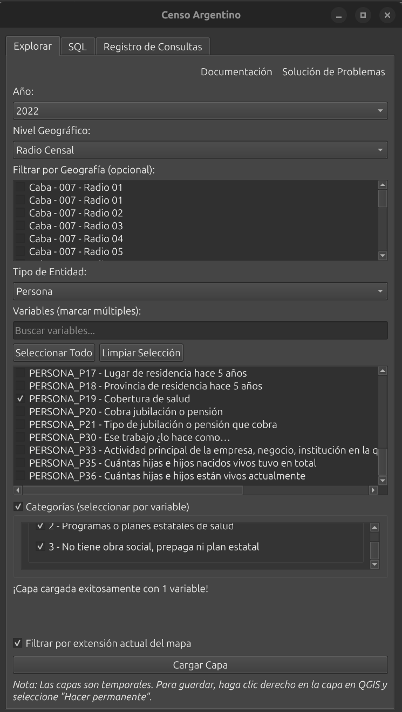

# Guía de Usuario

## Pestaña Explorar

Interfaz visual para seleccionar y cargar datos del censo.

### Opciones

| Opción | Descripción |
|--------|-------------|
| **Año** | Año del censo (actualmente solo 2022) |
| **Nivel geográfico** | Radio Censal, Fracción, Departamento o Provincia |
| **Tipo de entidad** | Filtra las variables disponibles: Hogar, Persona o Vivienda |

### Niveles geográficos

- **Radio Censal**: Máximo detalle (~52,000 polígonos)
- **Fracción**: Agrupación de radios
- **Departamento**: Partidos/departamentos provinciales
- **Provincia**: 24 jurisdicciones

Los niveles superiores agregan automáticamente las geometrías y suman los conteos.

### Seleccionar variables

1. Escriba en el buscador para filtrar (ej: "educacion", "vivienda")
2. Marque una o más variables
3. La descripción de la variable aparece debajo de la lista

### Seleccionar categorías (opcional)

Muchas variables del censo tienen **categorías** — por ejemplo, la variable de nivel educativo tiene categorías como "Sin instrucción", "Primaria", "Secundaria", etc.

Por defecto, todas las categorías se incluyen. Para filtrar categorías específicas:

1. Active la casilla **"Categorías (seleccionar por variable)"**
2. Expanda la variable deseada haciendo clic en el título
3. Seleccione/deseleccione categorías según necesite
4. Use los botones "Seleccionar todos" / "Deseleccionar todos" para control rápido

**Importante**: Cada combinación de variable+categoría genera una columna separada en la capa resultante. Por ejemplo, si selecciona "educación" con 5 categorías, obtendrá 6 columnas: una para cada categoría más una columna `_total` con la suma de todas.

!!! warning "Límite de columnas"
    - **50+ columnas**: Aparecerá una advertencia (puede continuar)
    - **100+ columnas**: Se bloqueará la carga para evitar problemas de rendimiento

    Considere reducir el número de variables o usar filtros de categorías.

### Filtros geográficos

**Por región:**
Marque provincias o departamentos en la lista. Solo se cargarán datos de las áreas seleccionadas.

**Por extensión del mapa:**
Active "Filtrar por extensión actual del mapa" para cargar únicamente los datos visibles en el canvas. Útil para trabajar con áreas específicas sin cargar todo el país.

### Resultado

El plugin genera una capa de polígonos con:

- Columna `geo_id` con el código del censo
- Para variables **con categorías**: una columna por categoría (ej: `educacion_primaria`, `educacion_secundaria`) más una columna `_total`
- Para variables **sin categorías**: una sola columna con el conteo total

**Nombres de columnas**: Las columnas se generan automáticamente con formato `variable_categoria` en minúsculas, sin espacios ni acentos. Por ejemplo:
- `PERSONA_P11` (categoría "Sí") → `persona_p11_si`
- `PERSONA_P19` (categoría "0-14 años") → `persona_p19_cat_0_14_anos`

## Caché

Los metadatos (variables y códigos geográficos) se almacenan en `~/.cache/qgis-censo-argentino/` tras la primera carga. Puede eliminar esta carpeta para forzar una recarga.
