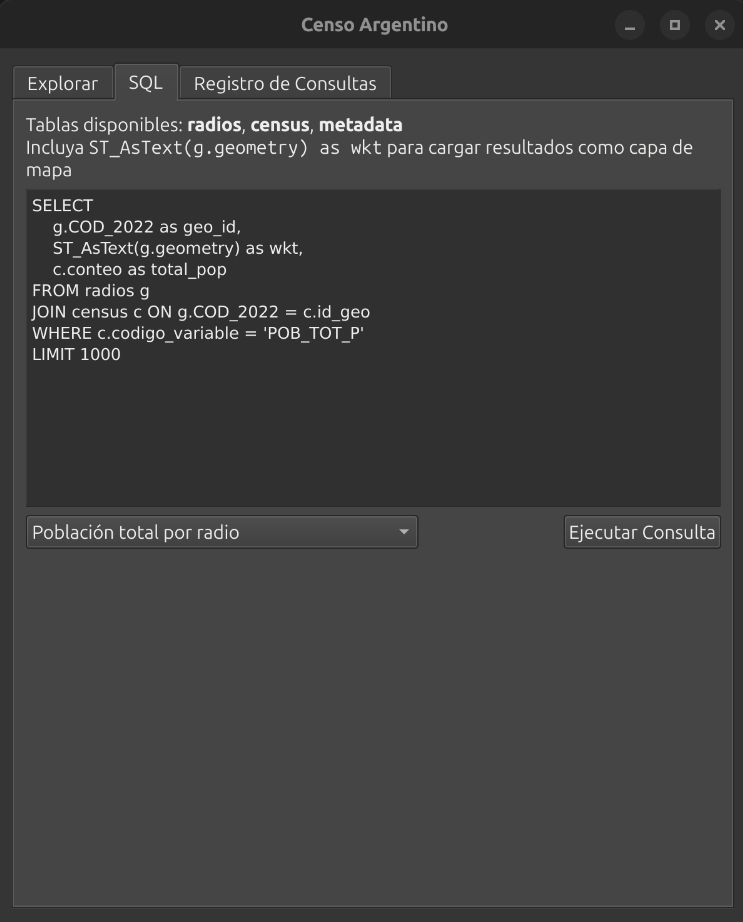
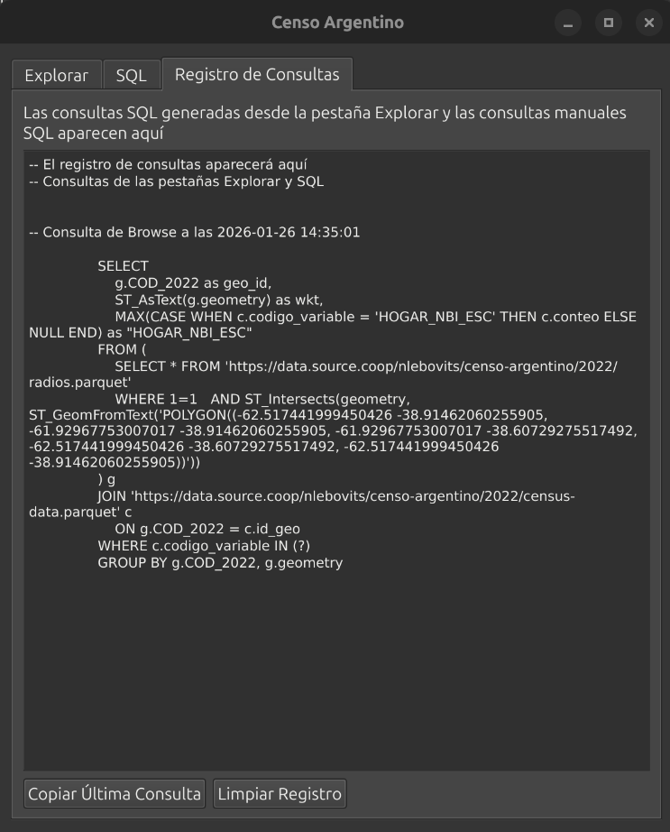

# Modo SQL

Acceso directo a los datos mediante consultas DuckDB.



## Tablas disponibles

| Tabla | Descripción |
|-------|-------------|
| `radios` | Geometrías de radios censales |
| `census` | Datos del censo en formato largo |
| `metadata` | Códigos y etiquetas de variables |

### Esquema de `radios`

```
COD_2022, PROV, DEPTO, FRACC, RADIO, geometry
```

### Esquema de `census`

```
id_geo, codigo_variable, conteo, valor_provincia, etiqueta_provincia,
valor_departamento, etiqueta_departamento, valor_categoria, etiqueta_categoria
```

### Esquema de `metadata`

```
codigo_variable, etiqueta_variable, entidad
```

## Crear capas de mapa

Para que el resultado se cargue como capa, incluya la geometría como WKT con alias `wkt`:

```sql
SELECT
    g.COD_2022 as geo_id,
    ST_AsText(g.geometry) as wkt,
    c.conteo as poblacion
FROM radios g
JOIN census c ON g.COD_2022 = c.id_geo
WHERE c.codigo_variable = 'POB_TOT_P'
```

Sin columna `wkt`, los resultados se muestran en el panel de registro de QGIS.

## Ejemplos

### Calcular un ratio

```sql
SELECT
    g.COD_2022 as geo_id,
    ST_AsText(g.geometry) as wkt,
    (a.conteo::float / NULLIF(b.conteo, 0)) * 100 as porcentaje
FROM radios g
JOIN census a ON g.COD_2022 = a.id_geo AND a.codigo_variable = 'VAR_A'
JOIN census b ON g.COD_2022 = b.id_geo AND b.codigo_variable = 'VAR_B'
```

### Agregar a nivel departamental

```sql
SELECT
    c.valor_provincia || '-' || c.valor_departamento as geo_id,
    ST_AsText(ST_Union_Agg(g.geometry)) as wkt,
    SUM(c.conteo) as total
FROM radios g
JOIN census c ON g.COD_2022 = c.id_geo
WHERE c.codigo_variable = 'POB_TOT_P'
GROUP BY c.valor_provincia, c.valor_departamento
```

### Filtrar por provincia

```sql
SELECT
    g.COD_2022 as geo_id,
    ST_AsText(g.geometry) as wkt,
    c.conteo
FROM radios g
JOIN census c ON g.COD_2022 = c.id_geo
WHERE c.codigo_variable = 'POB_TOT_P'
  AND c.etiqueta_provincia = 'Buenos Aires'
```

### Listar variables disponibles

```sql
SELECT DISTINCT entidad, codigo_variable, etiqueta_variable
FROM metadata
ORDER BY entidad, codigo_variable
```

## Registro de consultas

La pestaña **Registro de Consultas** muestra todas las consultas ejecutadas, incluyendo las generadas automáticamente desde la pestaña Explorar. Puede copiar cualquier consulta al portapapeles.


